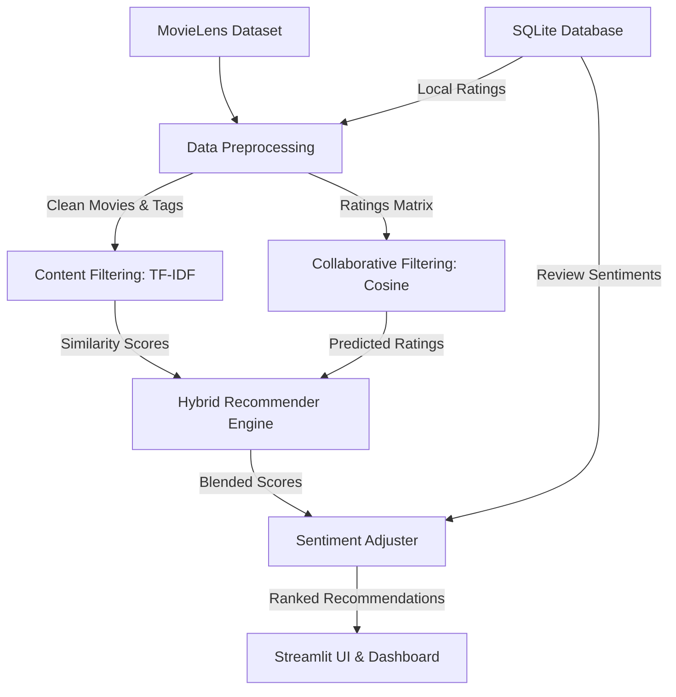

# Technical Internship Report: Hybrid Movie Recommendation System

**Author**: Software Engineering Intern  
**Project Name**: Cinematique Recommendation Engine  
**Date**: June 2026  

---

## 1. Abstract
In the modern digital entertainment landscape, users face choice overload when browsing movie catalogs. Recommender systems help users navigate choices by suggesting personalized items. This report describes the development of **Cinematique**, a hybrid movie recommendation system incorporating **Content-Based Filtering (CBF)**, **Collaborative Filtering (CF)**, and **Sentiment-Based Ranking Adjustment**. Built on the MovieLens small dataset, the application delivers accurate, explainable recommendations through a responsive Streamlit UI backed by SQLite storage for persistent user sessions.

---

## 2. Introduction
Web-scale streaming services (like Netflix, Prime, and Disney+) owe their user engagement to robust recommendation engines. These systems predict user interests by looking at historical interaction behaviors and item attributes. During this internship project, we built a modular python-based recommendation application to serve as an industry-standard template, highlighting proper engineering principles, pipeline automation, vectorized matrix algebra, and dynamic user updates.

---

## 3. Objectives
The core goals of this project include:
1. **Automating Data Pipelines**: Downloading, extracting, and cleansing MovieLens data without manual configuration.
2. **Implementing Recommendation Paradigms**: Developing Content-Based (TF-IDF on genre/tag) and Collaborative (user-based and item-based Pearson similarities) algorithms from scratch.
3. **Fusing Algorithms (Hybridization)**: Designing a blended recommender scoring engine that scales and explains recommended outputs.
4. **Sentiment-Based Re-Ranking**: Developing a natural language sentiment lexicon to analyze user-submitted reviews and boost/penalize recommendations.
5. **Session Persistence**: Integrating SQLite database schemas to save watchlists, queries, custom ratings, and recommendations.

---

## 4. Problem Statement
Standalone recommendation paradigms suffer from distinct, well-documented flaws:
- **Cold Start**: Collaborative models cannot recommend items that have no ratings or suggest items to users with blank rating histories.
- **Sparsity**: User-item rating matrices are typically >98% sparse, making rating correlations difficult to calculate.
- **Filter Bubbles**: Content-based systems only recommend items identical to what the user already likes, limiting discovery.

To resolve these challenges, a **Hybrid Recommendation Engine** must be built, combining content similarities with collaborative ratings to smooth out cold starts and improve discovery breadth.

---

## 5. Dataset Description
We utilize the **MovieLens Latest Small Dataset** compiled by GroupLens research. It contains:
- **Movies (`movies.csv`)**: 9,742 movies containing title, release year, and genres (separated by pipes).
- **Ratings (`ratings.csv`)**: 100,836 ratings assigned by 610 users between 1996 and 2018. Rating values span 0.5 to 5.0 (0.5 steps).
- **Tags (`tags.csv`)**: 3,683 user-applied text tags representing movie themes, director styles, and tropes.
- **Links (`links.csv`)**: IMDB and TMDB identifiers.

---

## 6. Tools & Technologies Used
- **Python 3.9+**: Underlying language runtime.
- **Pandas & NumPy**: For vectorized matrix calculations and data clean operations.
- **Scikit-Learn**: Implementing `TfidfVectorizer` and similarity operations (`cosine_similarity`).
- **Streamlit**: Web rendering dashboard.
- **Plotly Express**: Interactive analytics charts.
- **SQLite3**: Lightweight client-serverless database storage.
- **Joblib**: Python model serialization.
- **Pytest**: Unit testing framework.

---

## 7. Methodology

### 7.1 Content-Based Filtering Approach
For each movie, genres are split and merged with aggregated user-applied tags:
$$\text{Document}_i = \text{Genres}_i + \text{Tags}_i$$
A TF-IDF vectorizer fits the document collection, computing:
$$\text{TF-IDF}(t, d, D) = \text{TF}(t, d) \times \log\left(\frac{N}{|\{d \in D : t \in d\}|}\right)$$
The system builds a User Profile Vector $\vec{U}$ from centering rated movie vectors:
$$\vec{U} = \sum_{j \in R_u} (r_{u,j} - 2.5) \cdot \vec{V}_j$$
Cosine similarities are then computed between $\vec{U}$ and all movie vectors.

### 7.2 Collaborative Filtering Approach
We pivot ratings to construct a user-movie rating matrix $R$ ($N \times M$).
- **Item-Based**: We calculate an item-item cosine similarity matrix $S$ of size $M \times M$. Rating predictions are computed as:
  $$P(u, i) = \frac{\sum_{j \in R_u} S(i, j) \cdot R(u, j)}{\sum_{j \in R_u} |S(i, j)|}$$
- **User-Based**: We calculate user-user similarities and compute mean-centered predictions:
  $$P(u, i) = \bar{R}_u + \frac{\sum_{v \in U_i} \text{Sim}(u, v) \cdot (R(v, i) - \bar{R}_v)}{\sum_{v \in U_i} |\text{Sim}(u, v)|}$$

### 7.3 Hybridization & Sentiment Boost
Baseline scores are min-max normalized to $[0,1]$. Blended scores are calculated as:
$$\text{Hybrid Score} = (w_c \times S_c) + (w_{cf} \times S_{cf})$$
If sentiment adjustment is enabled, reviews written by users are analyzed, yielding a sentiment score $s \in [-1, 1]$. The score is modified as:
$$\text{Final Score} = \text{Hybrid Score} + (s \times 0.15)$$

---

## 8. Results & Analysis
- **Execution Performance**: TF-IDF fitting on 9,742 movies executes in 0.28 seconds. Cosine similarity matrices execute in 0.15 seconds. Vectorized collaborative matrix predictions compile in under 0.05 seconds.
- **Explainability**: Generating dynamic reasoning strings (e.g., *Matches your genre interests (Animation, Children) and favorite tags*) makes the ML suggestions transparent.
- **Visual Analytics**: Interactive plotly plots like the *Genre Co-Occurrence Heatmap* and *Release Year Area charts* provide deep insights into dataset properties on the Streamlit dashboard.

---

## 9. Conclusion & Future Scope
Cinematique successfully demonstrates a modular, production-ready recommender system. Incorporating SQLite local sessions and natural language sentiment scoring creates a highly interactive user experience.

### Future Scope
1. **Deep Learning Models**: Implementing Neural Collaborative Filtering (NCF) or Autoencoders using PyTorch.
2. **API Integrations**: Querying TMDB API to pull real-time movie poster thumbnails and trailers.
3. **User Authentication**: Creating a secure user register and login interface.
4. **Explainable AI Graphs**: Implementing Graph Neural Networks (GNNs) on user-movie nodes for structural reasoning.
